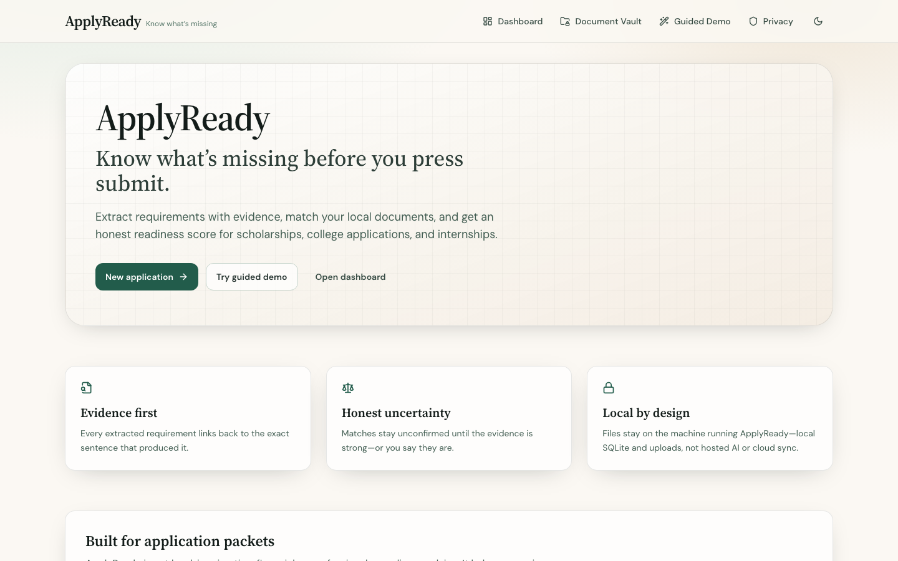
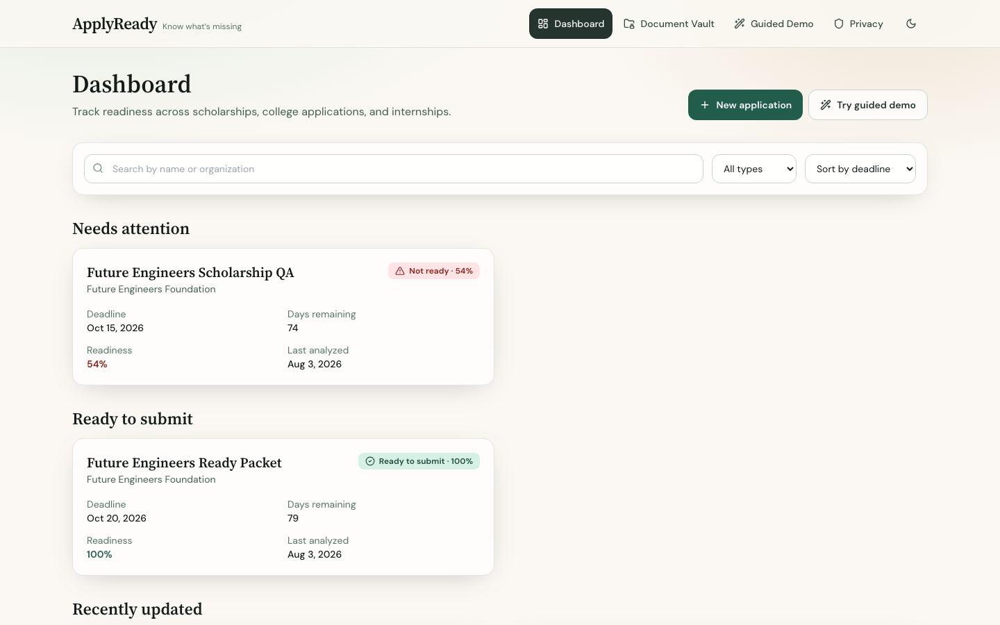
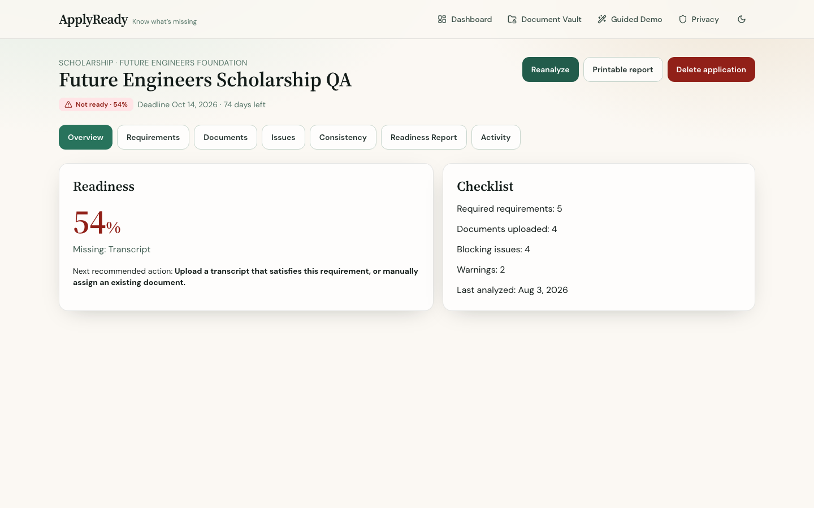
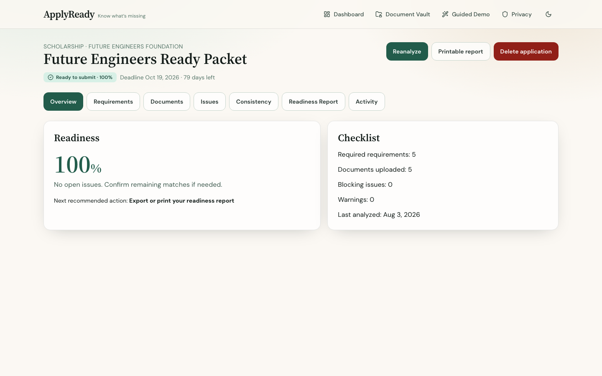

# ApplyReady

[](https://github.com/ManpreetS2/applyready/actions/workflows/ci.yml)

**Know what’s missing before you press submit.**

Applicants often submit incomplete, inconsistent, or incorrectly formatted application packets: a missing transcript, an essay over the word limit, a recommendation addressed to the wrong organization, or a filename that breaks the required pattern.

**ApplyReady** extracts evidence-backed application/document requirements, analyzes local documents, matches materials to those requirements, detects issues, and explains what remains before submission.

It is **not** a full ATS or job-qualification matcher. It does **not** scrape job boards, bypass anti-bot protections, or automatically reason about arbitrary natural-language eligibility such as years of experience, citizenship/work authorization, travel rules, or broad skill matching.

**Proof:** the fictional Future Engineers Scholarship guided demo progresses from **Not ready** to **Ready to submit** using the same deterministic pipelines as real packets.

**Privacy:** ApplyReady runs locally by default. The Express API stores metadata in a local SQLite database and uploaded files in a local upload directory on the machine running the app. Documents are not sent to hosted AI services, analytics, or cloud storage.

**Limitations:** no OCR (image-only PDFs may need conversion to searchable PDFs); signature checks are text-only; rule-based results may require confirmation; webpage extraction does not execute JavaScript; physical-device testing has not been completed.

> ApplyReady does not provide legal, immigration, financial, admissions, or professional compliance advice.



## Public interactive demo

Hosted portfolio demo URL (set after deployment; not live yet): `PUBLIC_DEMO_URL`

The hosted demo uses **generated fictional documents only** and is **not intended for private or sensitive information**. Real uploads, vault storage, arbitrary URL fetching, and global data deletion are disabled.

Independent concurrent demo sessions use unpredictable UUID application IDs. There are **no accounts** and **no authenticated private sessions**. Knowing a demo ID is enough to read that fictional temporary demo; IDs are not listed by any public endpoint. Stale demos are cleaned up automatically after a configurable TTL (default 6 hours).

| | Public demo mode | Full local mode |
|--|------------------|-----------------|
| Purpose | Recruiter walkthrough | Complete personal use |
| Uploads / vault / URL fetch | Disabled | Enabled |
| Concurrent visitors | Independent demo sessions (unpredictable IDs) | Single-machine local data |
| Accounts / auth | None | None (local machine trust) |
| Storage paths in UI/API | Hidden | Shown on Privacy page |

Security model and Docker instructions: [docs/PUBLIC_DEMO_DEPLOYMENT.md](docs/PUBLIC_DEMO_DEPLOYMENT.md).

Do **not** upload real personal documents to the hosted demo.

## Why this project matters

Application readiness is an evidence problem, not a chatbot problem. The hard parts are boring on purpose: safe local file handling, SSRF-resistant URL fetching, requirement extraction with source sentences, honest uncertainty states, consistency conflicts that never silently overwrite confirmed profile values, and a readiness score that cannot claim “ready” while blocking issues remain. ApplyReady is a portfolio-scale full-stack system that keeps those constraints visible instead of hiding them behind a generic AI summary.

## Feature highlights

- Evidence-backed requirement extraction from public URLs, PDF/DOCX/TXT/Markdown, or pasted text
- Document classification, fact extraction, matching, validation, and consistency checks
- Readiness scoring with blocking issues, warnings, and confirmation states
- Document vault for reusable local materials
- Printable readiness report + JSON export
- Guided demo that exercises the real pipelines end-to-end
- Local-first privacy model with destructive-action confirmations







## Guided demo

Open **Guided Demo** and start **Future Engineers Scholarship**. The packet begins **Not ready** (missing transcript, essay over limit, organization mismatches, email inconsistency, incorrect packet filename). Apply suggested fixes until it reaches **Ready to submit**.

If a recorded walkthrough is present:

[Guided demo video](docs/demo/applyready-guided-demo.webm)

## Architecture

See [docs/architecture.md](docs/architecture.md) for the Mermaid diagram and runtime boundaries.

```
packages/
  shared/   # Zod schemas + shared types
  server/   # Express API, SQLite, document/requirement pipelines
  client/   # React + Vite + Tailwind UI
qa/fixtures/applyready/  # Fictional QA fixture pack
```

Production mode: Express serves the compiled client from one process.

## Screenshots

| View | File |
|------|------|
| Landing | `docs/screenshots/landing-page.png` |
| Dashboard | `docs/screenshots/dashboard.png` |
| Requirement evidence | `docs/screenshots/requirement-evidence.png` |
| Not ready analysis | `docs/screenshots/not-ready-analysis.png` |
| Issue evidence | `docs/screenshots/issue-evidence.png` |
| Ready to submit | `docs/screenshots/ready-to-submit.png` |
| Document vault | `docs/screenshots/document-vault.png` |
| Printable report | `docs/screenshots/printable-report.png` |
| Mobile dashboard | `docs/screenshots/mobile-dashboard.png` |

## Supported document formats

- Requirements: public webpage URL, PDF, DOCX, TXT, Markdown, pasted text
- Application documents: PDF, DOCX, TXT, Markdown

Not supported in this version:

- OCR / image-only scan reading (image-only PDFs are detected and reported)
- Password-protected documents
- Macro/script execution
- Cloud syncing or hosted AI providers

## Requirements extraction

ApplyReady uses a deterministic pipeline:

- `RequirementSourceReader`
- `RequirementExtractor`
- `RequirementNormalizer`
- `RequirementDeduplicator`

It detects required vs optional language, document types, word/page limits, accepted formats, filename rules, recommendation counts, deadlines, GPA/eligibility cues, enrollment language, and more. Every requirement keeps the original source sentence, nearby context, confidence, and detection rule. Weak evidence is marked for user confirmation — the system does not invent requirements.

## Document matching

Documents are classified and matched with structured evidence from category, filename, title, headings, keywords, organization references, word/page counts, and file type.

Match states:

- Confirmed
- Likely match
- Possible match
- Does not match
- Needs user confirmation

Low-confidence matches are never auto-confirmed. Users can manually assign documents. Re-analysis preserves prior user confirmations.

## Readiness scoring

Scores range from 0–100 using weighted factors:

- required documents present
- match confirmation quality
- blocking issues
- warnings and uncertainty
- consistency conflicts

Status levels:

- Ready to submit
- Nearly ready
- Needs attention
- Not ready
- Unable to determine

A packet cannot be Ready when a required document is missing, a blocking rule fails, a required item lacks a confirmed/high-confidence match, or a critical inconsistency remains unresolved.

## Issue detection

ApplyReady detects missing documents, format problems, content mismatches, duplicates, low-text PDFs, filename errors, organization mismatches, and profile inconsistencies. Issues are labeled as blocking, warning, needs confirmation, or suggestion — and every warning includes evidence.

## Privacy

- ApplyReady runs as a local application (React client + Express API on your machine)
- Uploaded documents are stored in a local upload directory configured for that process
- SQLite stores metadata, extracted requirements, matches, issues, and short evidence excerpts locally
- No files are sent to hosted AI providers
- No analytics, telemetry, or tracking
- Destructive deletes require confirmation
- This is not browser-only storage: the local server process owns the database and files

## Technology stack

- Node.js 20+
- TypeScript (strict)
- npm workspaces
- React 18, Vite, React Router, Tailwind CSS, Lucide React
- Express, better-sqlite3, Zod, Multer
- Cheerio, Mozilla Readability, JSDOM
- pdfjs-dist, PDFKit (fixtures), Mammoth
- Vitest, Supertest, Playwright

## Local setup

```bash
npm install
npm run db:init
npm run dev
```

- API/UI proxy: client on `http://127.0.0.1:5173`
- API server: `http://127.0.0.1:8787`

## Commands

```bash
npm run dev
npm run typecheck
npm test
npm run test:unit
npm run test:integration
npm run test:e2e
npm run test:e2e:headed
npm run test:e2e:public-demo
npm run build
npm start
npm run qa
npm run verify:public-demo
npm run qa:public-demo
npm run screenshots
npm run demo:record
npm run db:init
npm run db:seed
npm run db:reset
```

`npm run qa` runs typecheck, unit tests, integration tests, production build, and Playwright E2E against an isolated temporary database/upload directory.

`npm run qa:public-demo` additionally verifies public-demo lockdown and Playwright coverage with `PUBLIC_DEMO_MODE=true`.

## Testing summary

- Unit: requirement extraction, document parsing/classification, matching/validation, URL SSRF protections
- Integration: API lifecycle, guided demo, fictional QA fixture pack (bad → ready, edge cases), public-demo security and concurrency
- E2E: core lifecycle, requirements formats, bad/corrected packets, vault, report PDF, keyboard accessibility, refresh resilience, dashboard filters, edge uploads
- Public-demo E2E: banner, restricted navigation, guided demo to Ready to submit, report, reset, dual-context independent sessions
- `npm run verify:public-demo`: production smoke for public-demo mode

Fictional fixtures live in `qa/fixtures/applyready/` and must not be copied into runtime `uploads/` by default. See `docs/QA_REPORT.md` for the latest verification record.

## Production build

```bash
npm run build
npm start
```

Open `http://127.0.0.1:8787`.

Docker public demo: see [docs/PUBLIC_DEMO_DEPLOYMENT.md](docs/PUBLIC_DEMO_DEPLOYMENT.md).

## Known limitations

- OCR is not included; image-only scans need conversion to searchable PDFs
- Rule-based analysis may require user confirmation
- Signature detection is text-only (“ApplyReady could not confirm that a signature is present”)
- Webpage fetching blocks private/local addresses and does not execute JavaScript
- Wizard progress is in-memory in the browser; refreshing the new-application wizard returns to step 1 with an honest reset (no false Ready state)
- Not a substitute for official checklist review
- Physical-device testing is out of scope unless separately performed
- Hosted public demo disables real uploads; it is not equivalent to full local mode
- Independent concurrent demos use unpredictable IDs without accounts; not authenticated private sessions or multi-user SaaS
- **Supported checks** focus on explicit application/document requirements: formats, counts (distinct documents), word/page limits (min/max/exact/range), filenames, GPA, enrollment evidence (explicit document text or confirmed profile field), deadlines (application + extracted, with cutoff-time preservation), conditional applicability, and consistency conflicts
- Confirmed real value mismatches remain blocking until underlying documents/profile values change; equivalent values do not block
- Any open `needs_confirmation` issue prevents Ready
- **Not yet** a full ATS qualification engine: no broad resume-vs-job skill matching, automatic job discovery, complex work-authorization qualification, or arbitrary natural-language eligibility reasoning
- Does not market or implement job-board scraping or anti-bot circumvention

## Future improvements

- Optional local/server AI provider behind existing interfaces
- OCR for scanned PDFs
- Richer eligibility condition modeling
- Additional application templates
- Deeper duplicate/near-duplicate detection

## Author

**Manpreet Singh**  
Computer Science Student at De Anza College

Built as a portfolio project exploring document processing, requirement extraction, evidence-grounded validation, local-first privacy, application readiness scoring, and full-stack software engineering.

## License

MIT
