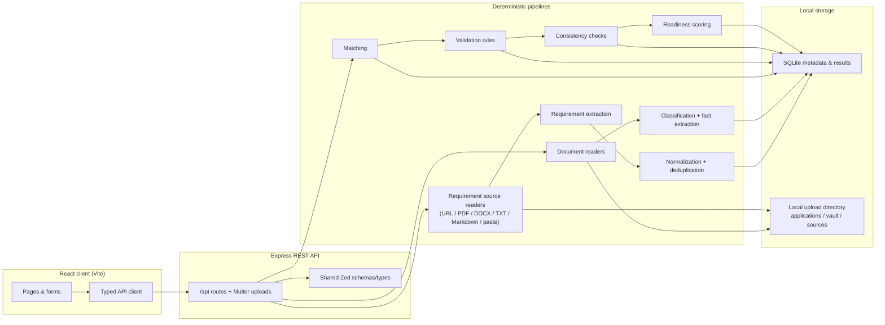

# ApplyReady architecture

ApplyReady is a local-first application readiness platform. Documents and extracted results stay on the machine that runs the app. This version does not call hosted AI providers and does not upload packets to cloud storage.

## Runtime boundaries

- **React client** talks only to the local Express API.
- **Express** validates uploads (size, extension, MIME, path safety), runs pipelines, and serves the production client build.
- **SQLite** stores application metadata, requirements, matches, issues, conflicts, validations, activity, and short extracted previews — not a dump of every raw page for the UI report.
- **Local files** live under configurable `APPLYREADY_UPLOADS_DIR` (default `uploads/`).
- **Provider interfaces** exist for a future optional server-side AI provider; the shipped behavior is fully deterministic and local.

## What this architecture deliberately avoids

- Browser-only storage as the system of record
- Hosted document sync
- Analytics/telemetry SDKs
- Silent “ready” claims without evidence-backed checks
